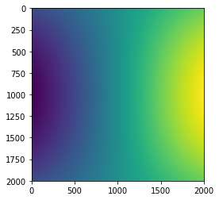

# CV192 Practical Session (Python/Numpy)
## Author: Ron Shapira Weber

Table of Contents
=================

 * [Python](#python)
    * [Getting started](#getting-started)
    * [Basic data types](#basic-data-types)
    * [Ipython](#ipython)
    * [Data Structures](#data-structures)
      * [Lists](#lists)
      * [Dictionaries](#dictionaries)
      * [Tuples](#tuples)
   * [Functions](#functions)
* [Numpy](#numpy)
   * [Arrays](#arrays)
   * [Indexing](#indexing)
   * [Some Math](#some-math)
   * [Linear Algebra](#linear-algebra)
   * [Probabilty](#probability)
   * [Broadcasting](#broadcasting)
   * [mgrid](#mgrid)
   * [Note about integers and floats in arrays](#note-about-integers-and-floats-in-arrays) 

* [Matplotlib](#matplotlib)
  * [Plotting](#plotting)
  * [Subplots](#subplots)
  * [Images](#images)
  * [Plotting in Ipython](#plotting-in-ipython)
* [OpenCV](#opencv)
   * [Loading, saving and displaying images](#loading-saving-and-displaying-images)
   * [Working with Matplotlib](#working-with-matplotlib)
   * [Image Operations](#image-operations)
 
# Python
Python is a high-level programming language. While this guide should cover most of the topics relevant to the course, feel free to visit the official [python documnetation](https://docs.python.org/3/tutorial/index.html).

## Getting Started 
There are two different versions of Python being supported at the moment, 2.7 and 3.6. 
In this course, however, we will use the following:
 - Python 3.6
 - Numpy > 1.11.*
 - Scipy > 0.18.*
 - Matplotlib > 1.5.*
 - OpenCV = 3.1.2 (with Python bindings).
 
 You can find instructions for installing **Python 3.6** (and the related packages, including OpenCV) via Anaconda [here](https://www.cs.bgu.ac.il/~mcv172/wiki.files/python_pkgs_and_opencv_installation_on_Ubuntu.txt). 
 Anaconda provides an easy way to manage environments, packages and scientific notebooks. It also includes **Spyder**, *IPython (both inside and outside Spyder) 
 and **Jupyter Notebooks**. 
 
 If you go with Anaconda, you can read how to manage package versions [here](https://conda.io/docs/user-guide/tasks/manage-pkgs.html) (Windows users should use Anaconda Prompt for package installation), otherwise you should probably use [pip](https://pip.pypa.io/en/stable/installing/).
 
 The recommended IDE in this class is **Spyder**, especially as a major part of the debugging in computer vision is done visually by inspecting figures/images, etc. 
 That said, this is only a recommendation. 

## Basic data types
**Numbers:**: include integers, floats, long and complex. 
Here are some basic arithmetics:

```python  
x = 4           # 'int'is the default type. Note there is no need for a semicolon at the end of a statement. 
print(x)        # Prints "2". 
print(type(x)) # Prints "<class 'int'>"
print(x + 1)   # Addition; prints "5"
print(x - 1 )  # Subtraction; prints "3"
print(x * 2)   # Multiplication; prints "8"
print(x ** 2)  # Exponentiation; prints "16"
print(x // 2.5)  # (floored) quotient of x and y; prints "1.0"
print(x % 2.5)   # module / remainder of x / y; prints "1.5"
x += 1    # Increases x by 1; Unlike in C++, there is no x++ in Python.
x *= 2    # Multiplies x by 2
# working with floats is similar
y = 1.5
print(type(y))  # Prints "<class 'float'>"

# casting from one type to another:
x = 2.5        # type(x) = 'float'
int(x)         # casts x to an integer; prints "2"
```

**Booleans:** 
```python
a = True
b = False
a and b        # False
a or b         # True
not a          # False
a != b         # True
print(int(a))   # prints "1" 

```
**Strings:**
```python
hello = 'hello'    # String variables can use either single quotes
world = "world"    # or double quotes; 
print(hello)       # Prints "hello"
print(len(hello))  # String length; prints "5"
helloWorld = hello + ' ' + world  # String concatenation
print(helloWorld)  # prints "hello world"
print(hello, 27)    # print "hello 27"
helloWorld27 = '%s %s %d' % (hello, world, 27)  # sprintf style string formatting
print(helloWorld27 )  # prints "hello world 27
print('{0} and {1}. Maybe even {2}.'.format('This','that',42)) # Print "This and that. Maybe even 42."

```

## Ipython
IPython is an interactive command shell which allows interactive Python sessions. 
It also supports using browser-based notebook (e.g **Jupyter Notebook**) and as well the use of data visualization. 
Note well: You don't have to use a Jupyter notebook to use IPython. For example, you can use it in your Linux shell.
Also, if you are using Spyder, you can find an Ipython shell in **Spyder** under the *IPython console* tab.

In some sense, IPython is similar to the console tab in Matlab . In **Spyder**, several Ipython tabs could be used at once, side by side.
When you see the following In[...], Out[...] in this tutorial below, it is the output of an IPython session.
Example:
```python
In[1]: my_string = "Wow, so very interactive"
In[2]: my_string
Out[2]: 'Wow, so very interactive'

```

## Data Structures
### Lists
Lists group together items/values and function in similar way to arrays. 
Lists can store multiple types of items and are resizeable and mutable. 

```python
squares = [1, 4, 9, 16, 25]
squares[0]     # Python is zero-based; returns "1"
squares[-1]    # returns the last item in the list; "25"
squares[-3:]   # slicing returns a new list; "[9, 16, 25]"

mixed_list = [4, 2.5, 'nine'] # different types of items can be stored in a single list

squares + [36, 49, 64, 81, 100] # list concatenation; 
# "[1, 4, 9, 16, 25, 36, 49, 64, 81, 100]"
squares[2] = 99 # lists are mutable; "[1, 4, 99, 16, 25]"

# a common way to add items to a list is via the append() method:
cubes = [1, 8, 27, 64, 125] # declare list
cubes.append(216)  # add 216 as the last value
cubes.append(7 ** 3)  # add 343 as the last value
# cubes: [1, 8, 27, 64, 125, 216, 343]

# slicing is an easy way to access and manipulate items in a list
# it returns a new (shallow) copy of the list:
squares[:]     #  "[1, 4, 9, 16, 25]"
nums = list(range(0,10,2))   # built-in function creates a "range" type, then convert it to a list;
# "[0,1,2,3,4]"
nums_even = list(range(5)
# "from 0 to 10 (exclusive) in steps of 2; "[0, 2, 4, 6, 8]"
even_reverse = list(range(10,0,-2))
# "from 10 to 0 (exclusive) in steps of -2; "[10, 8, 6, 4, 2]"
nums[2:4]             # Get a slice from index 2 to 4 (exclusive);"[2, 3]
nums[2:]              # Get a slice from index 2 to the end; prints "[2, 3, 4]"
nums[:2]              # Get a slice from the start to index 2 (exclusive);"[0, 1]"
nums[2:4] = [8, 9]    # Assign a new sublist to a slice

# list could act as multi-dimensional arrays 
A = [[1,2],[3,4]] # a 2x2 array
A[0][1] #returns "1". However, if you want arrays/matrices/etc., NumPy (see below) is the way to go.
```
**Loops**: iterating in python reads almost like pseudo code:
```python
bag = ['notebook', 'keys', 'lipstick']
for stuff in bag:
   print(stuff) # Python uses indentation to identify blocks of code
#prints 'notebook', 'keys', 'lipstick' 

#you can also add indices via the enumerate method
for idx, _ in enumerate(bag):
   print(idx)   
# prints '0, 1, 2'
# _ is a throw-away variable
```
Same goes for **while** loops:
```python
count = 0
while (count < 9):
   print(count)
   count = count + 1
```
**List Comprehensions**: Python supports list comprehension, which allows for
creating and manipulating lists in a single line of code:
```python
S = [x**2 for x in range(10)]
# [0, 1, 4, 9, 16, 25, 36, 49, 64, 81]
M = [x for x in S if x % 2 == 0] #only even numbers in S
# [0, 4, 16, 36, 64]
```

## Dictionaries
A dictionary stores (key, value) pairs. Dictionaries are indexed by key and not by indices, 
so it is best to think of a dictionary as an unordered set of *key: value* pairs.
```python
# This code is taken from an IPython session.
# Note that writing a variable name will 'Out' it's value
In[1]: n_seasons = {'GoT': 7, 'Friends': 10}

In[2]: n_seasons['GoT'] # getting the value stored under the key 'GoT'
Out[2]: 7

In[3]: n_seasons['Simpsons'] = 'inf' # adding a new (key, value)

In[4]: n_seasons
Out[4]: {'Friends': 10, 'GoT': 7, 'Simpsons': 'inf'}

In [5]: n_seasons['GoT']  = 8 # dictionary values are mutable

In [6]: n_seasons
Out[6]: {'Friends': 10, 'GoT': 8, 'Simpsons': 'inf'}

```

Some useful functions:
```python
del n_seasons('Friends')     # deletes the pair ('Friends', 10)
list(n_seasons.keys())    # returns an unsorted list of keys 
# ['Simpsons', 'GoT']
sorted(n_seasons.keys())  # returns a sorted list of keys 
# ['GoT', 'Simpsons']
'GoT' in n_seasons   # True
'Fauda' in n_seasons #False
```

**Loops**: you can iterate over dictionary keys, and use **list comprehensions** as well.
```python
for tv_show, seasons in n_seasons.items():
   print(tv_show, seasons)
# ('Simpsons', 'inf') <-- tuple
# ('GoT', 8)

S = {x:x**2 for x in range(4)} #note the curly brackets
# {0: 0, 1: 1, 2: 4, 3: 9}
```
## Tuples
A tuple is an immutable ordered list of values.
You can find more information on tuples [here](https://docs.python.org/3/tutorial/datastructures.html#tuples-and-sequences).

```python
t = (1,2)
t[0] #prints 1
t = (1,2 ,'dog')
t[2] #prints 'dog'
t[2] = 'cat' #Error! tuples are immutable
Traceback (most recent call last):
  File "<stdin>", line 1, in <module>
TypeError: 'tuple' object does not support item assignment

```
[This part is taken from the official Python documentation:](https://docs.python.org/3/tutorial/datastructures.html#tuples-and-sequences)

A special problem is the construction of tuples containing 0 or 1 items: the syntax has some extra quirks to accommodate these. Empty tuples are constructed by an empty pair of parentheses; a tuple with one item is constructed by following a value with a comma (it is not sufficient to enclose a single value in parentheses). Ugly, but effective. For example:
```python 
empty = ()
singleton = 'hello',    # <-- note trailing comma
print(len(empty))
#0
print(len(singleton))
#1
print(singleton)
#('hello',)

a = (3)  # this is an int
b = (3,) # this is a tuple! 
print(a)
# 3
print(type(a))
# int
print(b)
# (3,)
print(type(b))
#tuple
```
# Functions
A function is created by the keyword 'def' and is followed by the function name and a list of parameters.
for instance:
```python
def powers_of_three(n):
   x = [] #declaring an empty list
   for num in n:
      x.append(num**3)
   return x
   
# Calling the function
numbers = range(4)
print(powers_of_three(numbers))
#[0,1,8,27]
```

More information could be found [here](https://docs.python.org/3/tutorial/controlflow.html#defining-functions).

# Numpy
NumPy is a core Python package which supports multi-dimensional arrays and matrices, along with mathematical functions to operate on these arrays. 
For more information, visit the [quick start tutorial](https://docs.scipy.org/doc/numpy/user/quickstart.html). If you are a veteran MATLAB user, [Numpy for MATLAB user](http://mathesaurus.sourceforge.net/matlab-numpy.html) is also available and is highly recommended, even for non-matlab users.

Here we'll do a quick review of some of Numpy's essential functions, but feel free to download the tutorial notebooks provided [here](https://www.cs.bgu.ac.il/~mcv172/wiki.files/tutorial.tar) and play around with them, it's the best way to learn. You'll need Jupyter Notebook, you can use the [online version](https://try.jupyter.org/) or via Anaconda (please see [getting started](#getting-started)). 

## Arrays
An array is a table of elements (usually numbers), all of the same type, indexed by a tuple of positive integers. In NumPy dimensions are called axes.

**Array creation:**
```python
# First import numpy
import numpy as np #as np creates an alias

a = np.array([0,1,2,3]) # notice the syntax 
b = np.arange(0,4)    # similar to range, but numpy array
b = np.arange(0,4).astype(np.float) # creates an array of floats
print(a,b)
#([0, 1, 2, 3]),[0., 1., 2., 3.])
a.shape     #returns a tuple; (4,)
a.size      # returns an integer; 4
c = np.array([[1,2,3],[4,5,6]]) # a 2x3 array, rank 2 
c.shape     # (2,3)
c.size      # 6

# We can also create special pre-defined arrays
all_zeros = np.zeros((3,3)) # creates a 3x3 all zeros array
all_ones = np.ones((2,2))   # creates a 2x2 all ones array
all_twos = 2*np.ones((2,2)) # There's a better way to do this...
all_twos = np.full((2,2), 2) # creates a 2x2 all 2 array

identity_matrix = np.eye(3) #creates a 3x3 identity matrix
print(identity_matrix)
       # ([[1., 0., 0.],
       #   [0., 1., 0.],
       #    0., 0., 1.]])
 
# Reshaping
a = np.arange(0,12) #[0,1 ... ,11]
print(a.reshape((3,4))) 
#[[ 0  1  2  3]
# [ 4  5  6  7]
# [ 8  9 10 11]]

a.reshape((6,-1)) # here the -1 stands for: numpy, please do math for me...
# [[ 0  1]
#  [ 2  3]
#  [ 4  5]
#  [ 6  7]
#  [ 8  9]
#  [10 11]]

a.reshape(2,3,-1) 
#[[[ 0  1]
#  [ 2  3]
#  [ 4  5]]
#
# [[ 6  7]
#  [ 8  9]
#  [10 11]]]
a.shape #(2,3,2)

 ```
## Indexing
Indexing with 1-D Numpy arrays works similar to working python lists.

```python
a = np.arange(10)**3
print(a)
#array([  0,   1,   8,  27,  64, 125, 216, 343, 512, 729])
print(a[2])        # prints 8
print(a[2:5])      # prints array([ 8, 27, 64])
a[:6:2] = -1000    # equivalent to a[0:6:2] = -1000; from start to position 6, exclusive, set every 2nd element to -1000
print(a)
#array([-1000,     1, -1000,    27, -1000,   125,   216,   343,   512,   729])
a[ : :-1]          # reversed a
#array([  729,   512,   343,   216,   125, -1000,    27, -1000,     1, -1000])

a=np.linspace(0,1,11) # from 0 to 1, with 11 steps
print(a)
# [ 0.   0.1  0.2  0.3  0.4  0.5  0.6  0.7  0.8  0.9  1. ]
idx = np.array([0,2,5,3])
print(idx)
# [0 2 5 3]
print(a[idx])
# [ 0.   0.2  0.5  0.3]
```

Multi-dimensional arrays can have one index per axis. These indices are given in a tuple separated by commas.

```python
# The lines below are equivalent
tmp = np.arange(12).reshape(2,6)
print(tmp[1][5])
print(tmp[1][5])
print(tmp[1,5])
print(tmp[1][-1]) # negative indexing
print(tmp[1,-1]) # negative indexing
# prints(7)

# Array from function
def f(x,y):
   return 10*x+y

b = np.fromfunction(f,(5,4),dtype=int) # creates an array from a function
print(b)
#  array([[ 0,  1,  2,  3],
#       [10, 11, 12, 13],
#       [20, 21, 22, 23],
#       [30, 31, 32, 33],
#       [40, 41, 42, 43]])
b[2,3]         # '23'
b[0:5, 1]      # each row in the second column of b
#array([ 1, 11, 21, 31, 41])
b[ : ,1]       # equivalent to the previous example
#array([ 1, 11, 21, 31, 41])
b[1:3, : ]     # each column in the second and third row of b
#array([[10, 11, 12, 13],
#       [20, 21, 22, 23]])

#Iterating over multidimensional arrays is done with respect to the first axis:
for row in b:
   print(row)
#prints
#  [0 1 2 3]
#  [10 11 12 13] etc..

# flatteing an a multi-dimensional:
a = np.array([[1, 2, 3], [4, 5, 6]])
b  = np.ravel(a)
print(b)       #prints [1 2 3 4 5 6]
print(b.shape) #prints '(9L,)'


# np.squeeze removes single-dimensional entries from the shape of an array.
c = np.array([[[0], [1], [2]]])
print(c.shape) # (1L, 3L, 1L)
print(c)
#  [[[0]
#    [1]
#    [2]]]
print(np.squeeze(c).shape) # (3L,)
print (np.squeeze(c))
# [0 1 2]


```
**Indexing with Arrays of Indices**: 
```python
a = np.arange(12)**2              # the first 12 square numbers
i = np.array( [ 1,1,3,8,5 ] )     # an array of indice 
print(a[i])                       # i can be of different shape than a
# array([ 1,  1,  9, 64, 25])

# another possible syntex
print(a[0], a[3]) # [0,9]

j = np.array( [ [ 3, 4], [ 9, 7 ] ] )      # a bidimensional array of indices
print(a[j])                                # the same shape as j
#array([[ 9, 16],
#      [81, 49]])
```


**Boolean indexing**: A useful way to quary numpy  arrays is via boolean indexing. 
```python
# boolean indexing can be done explicitly
a = np.arange(5)                        #[0, 1, 2, 3, 4];
b = np.array([0,0,1,0,1],dtype=np.bool) # needs to be the same shape as a
# [False, False,  True, False,  True]
print(a[b]) 
# array([2, 4])    # Different shape than 'a'

# Or by logical operations
a = np.arange(12).reshape(3,4) 
#     ([[ 0,  1,  2,  3],
#       [ 4,  5,  6,  7],
#       [ 8,  9, 10, 11]])
b = a > 4
b                      # b is a boolean with a's shape
# array([[False, False, False, False],
#      [False,  True,  True,  True],
#       [ True,  True,  True,  True]], dtype=bool)

print(a[b])            # 1d array with the selected elements
array([ 5,  6,  7,  8,  9, 10, 11])

#This property can be very useful in assignments:
a[b] = 0               # All elements of 'a' higher than 4 become 0
print(a)
array([[0, 1, 2, 3],   # assignments doesn't changes the shape of a
       [4, 0, 0, 0],
       [0, 0, 0, 0]]) 
```
For more on indexing with array of indices, please visit [numpy's documentation](https://docs.scipy.org/doc/numpy-dev/user/quickstart.html#indexing-with-arrays-of-indices).

**Linear Indexing**: Sometimes we may want to flatten multi-dimensional array but still use its original coordinates and vice versa.
For this we can use the *unravel_index* and *ravel_multi_index* methods:
```python
a_arr = np.arange(12).reshape(3,-1)
#array([[ 0,  1,  2,  3],
#       [ 4,  5,  6,  7],
#       [ 8,  9, 10, 11]])

a_flat = np.ravel(a_arr)
#array([ 0,  1,  2,  3,  4,  5,  6,  7,  8,  9, 10, 11])
idx = np.argwhere(a_flat%3==0) # returns indices for a condition
print(a_flat[idx].T) # returns row vector
# array([[0, 3, 6, 9]])

# We want the indices in the dim of a_arr
idx_arr = np.unravel_index(idx, a_arr.shape) 
#(array([[0],
#        [0],
#        [1],
#        [2]], dtype=int64), array([[0],
#        [3],
#        [2],
#        [1]], dtype=int64))
print(a_arr[idx_arr].T)
#[[0 3 6 9]]

# The other way around...
#np.ravel_multi_index Converts a tuple of index arrays into an array of flat indices
idx_flat = np.ravel_multi_index(idx_arr, a_arr.shape)
print(idx_flat.T)
# array([[0, 3, 6, 9]], dtype=int64)

```
## Some Math
```python 
a = np.arange(6).reshape(2,3)
#array([[0, 1, 2],
#       [3, 4, 5]])

# same goes for min(), argmin() and minimum() functions
a.max(0) 	# maximum element along an axis
# array([3, 4, 5])
a.max(1)
# array([2, 5])
a.argmax(0) # Returns the indices of the maximum values along an axis.
# array([1, 1, 1])
a.argmax(1)
# array([2, 2])
a.argmax() # if no axis is given, the index is of the flattened array
# 5

# np.maximum is a bit different -
# It compares two arrays and returns a new array containing the element-wise maxima:
np.maximum(a[0,:], a[1,:]) # maximum between first and second rows of 'a'
#array([3, 4, 5])

# Sum()
np.sum(a)       # Compute sum of all elements;   '10'
np.sum(a, axis=0)  # Compute sum of each column; '[4 6]'
np.sum(a, axis=1)  # Compute sum of each row;    '[3 7]'

# As well as the more OOP
a.sum()       # Compute sum of all elements;   '10'
a.sum(axis=0)  # Compute sum of each column; '[4 6]'
a.sum(axis=1)  # Compute sum of each row;    '[3 7]'

np.e                  #2.718281828459045
np.exp(1)             #2.718281828459045
np.exp(np.arange(5))  # handle  arrays
# array([1. ,   2.71828183,   7.3890561 ,  20.08553692,  54.59815003])
np.log([1, np.e, np.e**2])  #natural log in base e = lan
# array([  0.,   1.,   2., -Inf])
np.log2(8)     #base 2 log
# 3
```

## Linear Algebra
Numpy has many bulit-in linear algebra operation which could be used on numpy arrays. Again, please visit [numpy for matlab users](https://docs.scipy.org/doc/numpy-dev/user/numpy-for-matlab-users.html) for more on numpy's linear algebra operations.

```python
a = np.arange(1,5, dtype=float).reshape(2,2) 
#  [[ 1.  2.]
#   [ 3.  4.]]

a.T             # matrix transpose 
#  [[ 1.,  3.],
#   [ 2.,  4.]]

a.transpose()   # also, matrix transpose, allows for more than 2-dimensions
#  [[ 1.,  3.],
#   [ 2.,  4.]]

c = np.arange(8).reshape(2,2,-1) # -1 tells numpy to choose dim of this axis
#array([[[0, 1],
#        [2, 3]],
#
#       [[4, 5],
#        [6, 7]]])

c.transpose([2,1,0]) #order of axis to transpose
#array([[[0, 4],
#        [2, 6]],
#
#       [[1, 5],
#        [3, 7]]])

c.transpose([0,2,1]) 
#array([[[0, 2],
#        [1, 3]],
#
#       [[4, 6],
#        [5, 7]]])

np.linalg.inv(a)    # find the matrix inverse of 'a', usually computationally expensive
#     [[-2. ,  1. ],
#      [ 1.5, -0.5]])

b = np.full((2,2), 2)
a*b   #element-wise multiply 
# array([[2., 4.],
#        [6., 8.]])

I = np.eye(2) # unit 2x2 matrix; "eye" represents "I"
j = np.array([[0.0, -1.0], [1.0, 0.0]])

np.dot (j, j) # matrix product
#  array([[-1.,  0.],
#       [ 0., -1.]])

np.trace(I)  # trace
# 2.0
np.diag(a)   #vector of diagonal elements of 'a'
# [1., 4.]

v = np.array([2,3])
np.linalg.norm(v) # L2 norm of vector v; 
# 3.605551275463989

D,V = np.linalg.eig(a)        # eigenvalues and eigenvectors of a
D,V = np.linalg.eig((a,b)) # eigenvalues and eigenvectors of a, b
```

**Vector Stacking**: it is possible to stack vectors on top of each other. 
```python
c = np.ones((1,3))      #array([[1., 1., 1.]])
d = 2*np.ones((1,3))    #array([[2., 2., 2.]])
vertical_stack = np.vstack([c,d])

#array([[1., 1., 1.],
#       [2., 2., 2.]])

horizontal_stack = np.hstack([c,d])
# array([[1., 1., 1., 2., 2., 2.]])

np.tile(c, (2, 3))    #create 2 by 3 copies of a
#array([[1., 1., 1., 1., 1., 1., 1., 1., 1.],
#       [1., 1., 1., 1., 1., 1., 1., 1., 1.]])
```

## Probability 
Numpy (and SciPy) provides several useful functions for doing probablity and statistics.
 ```python
random_arr = np.random.random((2,2)) #creates an array with random values
random_normal = np.random.randn(2,2) # a 2x2 sampled from N(0,1)
print(random_normal)
#might output:
#     [[-1.25527029,  1.12880546],
#      [-0.78455754, -0.34960907]]

sigma = 2.5
mu = 3
random_normal2 = sigma*np.random.randn(2,2)+mu #a 2x2 sampled from N(3,6.25)=(mu,sigma^2)
print(random_normal2)
#      [[1.28169047, 1.64080373],
#       [4.76906697, 3.05345461]]

# Sample from an array with a corresponding probabilities array
# Generate a non-uniform random sample from np.arange(5) of size 3:
np.random.choice(np.arange(5), 3, replace=False, p=[0.1, 0, 0.3, 0.6, 0])
# might output array([2, 3, 0])

# replacing np.arange(5) with 5 yield the same result
np.random.choice(5, 3, replace=False, p=[0.1, 0, 0.3, 0.6, 0])
# might output array([2, 0, 3])

# # replacing the replace=True allows for sampling the same value
np.random.choice(5, 3, replace=True, p=[0.1, 0, 0.3, 0.6, 0])
# might output array([3, 3, 0])


# some statistics
a = np.array([1,1,2,2,2,2,3,3,4]);
np.random.permutation(a) #[4, 1, 2, 3, 2, 2, 1, 2, 3]
np.median(a)  # 2.5
np.mean(a) # 2.5 #changed from np.average(), please use np.mean()
np.std(a)     # 1.1180339887
np.var(a)     # 1.25

# You can also use the more OOP approach
a.mean() # etc...
```

**Allclose:**
np.allclose compares two arrays element wise, and returns True if the following is true: 

      absolute(a - b) <= (atol + rtol * absolute(b)). 

The above equation is not symmetric in a and b, so that allclose(a, b) might be different from allclose(b, a) in some rare cases.
```python
a = np.arange(5)
b = a + 0.001*np.random.randn(5) #1e-03
c = a + 1e-05*np.random.randn(5)
d = a + 1e-08*np.random.randn(5)

print("#1 a, b are all close: ", np.allclose(a,b))
print("#1 a, c are all close: ", np.allclose(a,c))
print("#1 a, d are all close: ", np.allclose(a,d))

# It is possible to change the tolerance values
# default values (rtol=1e-05, atol=1e-08)

print("#2 a, b are all close: ", np.allclose(a,b, rtol=0.01, atol=1e-04))
print("#2 a, c are all close: ", np.allclose(a,c, rtol=0.01, atol=1e-04))
print("#2 a, d are all close: ", np.allclose(a,d, rtol=0.01, atol=1e-04))

# Output:
#1 a, b are all close:  False
#1 a, c are all close:  False
#1 a, d are all close:  True

#2 a, b are all close:  False
#2 a, c are all close:  True
#2 a, d are all close:  True 
```

## Broadcasting
From the official [documentation:](https://docs.scipy.org/doc/numpy-1.13.0/user/basics.broadcasting.html)

*The term broadcasting describes how numpy treats arrays with different shapes during arithmetic operations. Subject to certain constraints, the smaller array is �broadcast� across the larger array so that they have compatible shapes. Broadcasting provides a means of vectorizing array operations so that looping occurs in C instead of Python. It does this without making needless copies of data and usually leads to efficient algorithm implementations. There are, however, cases where broadcasting is a bad idea because it leads to inefficient use of memory that slows computation.*

```python
# The trivial case of broadcasting a scalar to an array:
a = np.array([1.0, 2.0, 3.0])
b = np.array([2.0])
a * b            
# array([ 2.,  4.,  6.])
# We can think of the scalar b being stretched during the arithmetic 
# operation into an array with the same shape as a.

```

**General broadcasting Rules:**
*When operating on two arrays, NumPy compares their shapes element-wise. It starts with the **trailing** dimensions, and works its way forward. **Two dimensions** are compatible when:*
   1. they are equal, or
   2. one of them is 1
   
A trailing dimension refers to the axis which is not common to the arrays which are being broadcast. For instance, when working with two arrays, one with shape = 1x2x3 and the other 2x3, the trailing dimension will be 1. This means that arrays do not need to have to same number of dimensions:

```python
# Let's say we want to scale each of an image color channels by a different value.
image = np.ones((16,16,3))
scale = np.array([1,2,3])

image.shape, scale.shape
# ((16, 16, 3), (3,))

scaled_image = Image*scale 
# output will look something like this
#       [[1., 2., 3.],
#        .
#        .
#        .
#        [1., 2., 3.],
#        [1., 2., 3.]],

scaled_image.shape
# (16, 16, 3)
```
In the previous exmaple we saw that when broadcasting 2 arrays and one of the dimensions is 1, it is "streched" to match the other( 1 -> 16). This exmaple (Taken from the documentation) expands this notion to several dimensions:
```pyhon
# In this exmaple A,B are pre-defined
A      (4d array):  8 x 1 x 6 x 1
B      (3d array):      7 x 1 x 5
Result (4d array):  8 x 7 x 6 x 5

A      (2d array):  5 x 4
B      (1d array):      1
Result (2d array):  5 x 4

A      (2d array):  5 x 4
B      (1d array):      4
Result (2d array):  5 x 4

A      (3d array):  15 x 3 x 5
B      (3d array):  15 x 1 x 5
Result (3d array):  15 x 3 x 5

A      (3d array):  15 x 3 x 5
B      (2d array):       3 x 5
Result (3d array):  15 x 3 x 5

A      (3d array):  15 x 3 x 5
B      (2d array):       3 x 1
Result (3d array):  15 x 3 x 5
```
Here are examples of shapes that do not broadcast:
```python 
A      (1d array):  3
B      (1d array):  4 # trailing dimensions do not match

A      (2d array):      2 x 1
B      (3d array):  8 x 4 x 3 # second from last dimensions mismatched
```
**Outer product with broadcasting:**

```python
a = np.array([0.0, 10.0, 20.0, 30.0])
b = np.array([1.0, 2.0, 3.0])
a[:, np.newaxis] + b       # np.newaxis adds a new axis (dim=1)
#array([[  1.,   2.,   3.],
#       [ 11.,  12.,  13.],
#       [ 21.,  22.,  23.],
#       [ 31.,  32.,  33.]])
# equally, we can do:
c = a.reshape(4,1)  # 1 is the trailing axis
c + b
#array([[  1.,   2.,   3.],
#       [ 11.,  12.,  13.],
#       [ 21.,  22.,  23.],
#       [ 31.,  32.,  33.]])

```
**Row mean Subtraction with broadcasting:**
```python
# Another working exmaple of broadcasting:
a = np.arange(12.0).reshape(3,-1) 
print(a)
print (a.mean(axis=0))
print ('a.shape =',a.shape) # (3,4)
print ('a.mean(axis=0).shape =',a.mean(axis=0).shape) # (4,)
print(a - a.mean(axis=0))  # Still works.
try: 
    print ('a - a.mean(axis=1) will fail')
    print(a - a.mean(axis=1)) # this fails though:
                          # ValueError: operands could not be broadcast together with shapes (3,4) (3,) 
except ValueError:
    print ('but a.T - a.mean(axis=1) works')
    print(a.T - a.mean(axis=1)) # This works.
    
# Will output:
"""
[[ 0.  1.  2.  3.]
 [ 4.  5.  6.  7.]
 [ 8.  9. 10. 11.]]
[4. 5. 6. 7.]
a.shape = (3, 4)
a.mean(axis=0).shape = (4,)
[[-4. -4. -4. -4.]
 [ 0.  0.  0.  0.]
 [ 4.  4.  4.  4.]]
a - a.mean(axis=1) will fail
but a.T - a.mean(axis=1) works
[[-1.5 -1.5 -1.5]
 [-0.5 -0.5 -0.5]
 [ 0.5  0.5  0.5]
 [ 1.5  1.5  1.5]]
"""
```

## mgrid
mgrid is one of numpy's most useful functions. it retruns an instance of a mesh-grid which could be used for creating coordinate arrays over some function. Please also review the  **mgrid.ipynb** jupyter notebook which is provided in the [tutorial files](#getting-started), especially the **speed-up** when comparing to for-loops .

```python
y, x = np.mgrid[-2:3:1, -2:3:1] # from -2 to 3 (exclusive) steps of 1 
print(y)
#array([[-2, -2, -2, -2, -2],
#       [-1, -1, -1, -1, -1],
#       [ 0,  0,  0,  0,  0],
#       [ 1,  1,  1,  1,  1],
#       [ 2,  2,  2,  2,  2]])
print(x)
#array([[-2, -1,  0,  1,  2],
#       [-2, -1,  0,  1,  2],
#       [-2, -1,  0,  1,  2],
#       [-2, -1,  0,  1,  2],
#       [-2, -1,  0,  1,  2]])

def f(x,y):
   return np.cos(x)*np.sin(y)
fxy = f(x,y)
#array([[ 0.37840125,  0.35017549, -0. , -0.35017549, -0.37840125],
#       [-0.4912955 , -0.45464871,  0. ,  0.45464871,  0.4912955 ],
#       [-0.90929743, -0.84147098,  0. ,  0.84147098,  0.90929743],
#       [-0.4912955 , -0.45464871,  0. ,  0.45464871,  0.4912955 ],
#       [ 0.37840125,  0.35017549, -0. , -0.35017549, -0.37840125]])

```
Which looks something like this:



## Note about integers and floats in arrays
This will be useful in HW2.
Suppose you need to run some computation which involves 1/T, and you want to try three different values of T:
```python
T=1
T=1.5
T=2.
```
In Python, the following will not always give you what you want:
```python 
# do some calc which involves 1/T), for instace:
For T in [1,1.5,2]:
    print 1/T
# prints:    
1
0.666666666667
0

```

The problem is that T is int.
When T=1, this is fine, since we have 1/1, and this is just 1. 
When 1/1.5 this is still fine and you get what you expect, since 1.5 is a float so python converts int/float to float/float. 
But with 1/2 you get zero and not what you expect. 
Try 1.0 / 2 instead, or even 1/np.float(2). 
The right way to go about it using
```python
For T in [1.0,1.5,2.0]...
# or
For T in np.array([1,1.5,2],dtype=np.float)...
# or 
For T in np.array([1,1.5,2]).astype(float)...
# or
For T in [1,1.5,2]:
     T = float(T)
     # some calcs. 

```

# Matplotlib
Matplotlib is a plotting library which enables several 2D/3D plotting capabilites. We will mostly focus on the *matplotlib.pyplot* which is a collection of command style functions that make matplotlib work like MATLAB. 
.
## Plotting 
Simple line plotting:
*y = 4x+1*
```python 
import numpy as np
import matplotlib.pyplot as plt # plt is the convention

x = np.arange(-10,10)     # from -10 until 9, steps of 1
y = [4*a+1 for a in x]    # y = 4x+1
y = np.array(y)           # casting y to np.array, so we could use min() 

# We'll set our axis to the min/max values of x,y:
plt.axis([x.min(), x.max(), y.min(), y.max()])
# [-10, 9, -39, 37]

# set axes names and title
plt.plot(x,y)
plt.xlabel('x axis label')
plt.ylabel('y axis label')
plt.title(' y = 4x+1')
plt.show()
                
```
The plot: 


Please visit the [documentation](https://matplotlib.org/api/_as_gen/matplotlib.pyplot.plot.html) for more info.

**Plotting several plots:** 
The general formatting of the 'plot' function is the following:

         plot([x], y, [fmt], [x2], y2, [fmt2] ...)

Where [fmt] stands for formatting:

      fmt = '[color][marker][line]'
      
For instance:
```python
import numpy as np
import matplotlib.pyplot as plt

# evenly sampled time at 200ms intervals
t = np.arange(0., 5., 0.2)

# red dashes: ('r--') r = red, -- = dashed marker
# blue squares: ('bs') b = blue, s = square marker
# green triangles ('g^') g = green, ^ = truangle
plt.plot(t, t, 'r--', t, t**2, 'bs', t, t**3, 'g^')
plt.show()
```


## Subplots
The subplot command allows for plotting several figures in the same window. 

Let's say we want to explore how changing the variance affects the gaussian distribution:

```python 
# First we'll define our gaussian function :
def g(mu, sigma, x):
    return np.exp(-np.power(x-mu,2.) / (2.*np.power(sigma,2.))) / (np.sqrt(2.*np.pi*(np.power(sigma,2.)))) 

# Define different values of sigma
sigma1, sigma2, sigma3  = 0.1, 0.5, 2

# Define X axis
# we define two arrays of values for the following reasons:
# 1) highlights every 0.5 the value of our function (points)
# 2) plots our line
x1 = np.arange(-3.0, 3.0, 0.5) 
x2 = np.arange(-3.0, 3.0, 0.02)

# First subplot
plt.figure(1)            # declare the figure 
plt.subplot(311)         # 311 -> 3 rows, 1 columns, 1st subplot
plt.plot(x1, g(0, sigma1, x1), 'bo', x2, g(0, sigma1, x2), 'b') # 'bo': blue circle markers, 'b': black line

# Second subplot, notice we're not actually plotting anything yet
# Also, we're not declaring another figure, since we're subplotting into it.
plt.subplot(312)         # 311 -> 3 rows, 1 columns, 2nd subplot
plt.plot(x1, g(0, sigma2, x1), 'gs', x2, g(0, sigma2, x2), 'g') # 

# Third subplot
plt.subplot(313)         # 311 -> 3 rows, 1 columns, 3nd subplot
plt.plot(x1, g(0, sigma3, x1), 'r^', x2, g(0, sigma3, x2), 'r') # 


# Plotting
plt.subplots_adjust(hspace=0.4) #make subplots farther from each other.
plt.show()
```


Now Let's say we want to plot an unknown number of subplots for various values of sigma.
Also, we'll added titles for each subplot and use LateX formatting.

```python
# Let's plot a Nx3 grid with different values of sigma

sigmas = np.arange(0.1,3,0.25) #from 0 to 3 (excluded) in steps of 0,3
rows = len(sigmas)//3 + 1       # // floored 

f = plt.figure(1) 
f.set_size_inches(10,10)
for idx, sig in enumerate(sigmas):
    idx += 1 #subplotting is 1-based
    plt.subplot(rows,3,idx) # same as (e.g 311 -> 3,1,1)
    plt.plot(x1, g(0, sig, x1), 'bo', x2, g(0, sig, x2), 'k')
    
    # we can add LateX to our plot title by using r"&\" syntax, for instance:
    plt.title(r'$\sigma$ = {0:.2f}'.format(sig)) # .format(sig) assigns the variable sig to .2f

plt.subplots_adjust(hspace=0.4) #make subplots farther from each other.
plt.show()
```


We can iterate over the axes we've created as well by creating declaring the size of our subplots explicitly.

```python
# Let's plot a Nx3 grid with different values of sigma
x1 = np.arange(-3.0, 3.0, 0.01) 
sigmas = np.arange(0.1,3,0.25)  #from 0 to 3 (excluded) in steps of 0,3
(rows, cols) = sigmas.reshape(3,-1).shape

# declare the size and number of subplots
fig, axes = plt.subplots(nrows=rows, ncols=cols, figsize=(15, 5))

# we can iterate of axes:
for idx, ax in enumerate(axes.flat):
    sig = sigmas[idx]
    ax.plot(x1, g(0, sig, x1), 'k')
    ax.fill_between(x1, 0, g(0, sig, x1)) # color the area under the graph between y = 0 and y = g(x1)
    
    # we can add LateX to our plot title by using r"&\" syntax, for instance:
    ax.set_title (r'$\sigma$ = {0:.2f}'.format(sig)) # .format(sig) assigns the variable sig to .2f


plt.subplots_adjust(hspace=0.6) #make subplots farther from each other.
plt.show()
```


You can find more subplots examples [here](https://matplotlib.org/examples/pylab_examples/subplots_demo.html#pylab-examples-subplots-demo)

## Images
Matplotlib support image operations. While we'll mostly work with OpenCV, it is worth knowing the basics.
You can find more on Matplotlib [official image tutorial.](https://matplotlib.org/users/image_tutorial.html)

The *imread()* command allows us to load images as numpy arrays. Matplotlib rescaled the 8 bit data from each channel to floating point data between 0.0 and 1.0. Matplotlib plotting can handle float32 and uint8, but image reading/writing for any format other than PNG is limited to uint8 data.

As you'll see in the [OpenCV section](#opencv), using *cv2.imread()* has its downsides. Therefor, when possible, we recommend using *plt.imread()*.

```python
import matplotlib.pyplot as plt
import numpy as np

holy_grail = plt.imread('monty.png')
plt.imshow(holy_grail)
plt.axis('off')
```
|  |
|:--:| 
| [source](http://www.insidethemagic.net/2017/05/now-something-completely-different-montys-pythons-john-cleese-tour/) |

Matplotlib *imshow()* is quite useful for visuallzing functions:

```python
#You should recall this from the mgrid section, with small alterations
y, x = np.mgrid[-3:4:0.1, -3:4:0.1]

def f(x,y):
   return np.cos(x)*np.sin(y)

fxy = f(x,y)


# We can explicitly declare the figure and axes 
fig, axes = plt.subplots(nrows=2, ncols=1, figsize=(8, 5)) 
fig.suptitle("f(x,y) = cos(x)*sin(y)", fontsize=16) # main title


# You can choose the type of interpolation between adjacent cells in the (discrete) mgrid
# as well as the color map (cmap).
ax = plt.subplot(121)
plt.imshow(fxy, interpolation='bilinear', cmap = 'gray')
ax.set_title("interpolation = 'bilinear'")  #set title to this 'ax'

ax = plt.subplot(122)
ax.set_title("interpolation = 'None' ")
plt.imshow(fxy, interpolation="None", cmap = 'gray') 
# Note well. It is the string "None", which is different from interpolation=None
# where uses Python's built-in constant, None.

# we can play with the anchor's location to relocate our colorbar
cbar = plt.colorbar(ax=axes, anchor = (2,0)) 
plt.show()
```


**Interpolation:** When debugging computer vision you sometimes have to take a close look at the actual pixels, and if you let imshow interpolate for you, you will see interpolation effect instead of the actual pixels. 
Also worth noting in this context is that in MATLAB the default is exactly the opposite:
if no argument is passed, imshow defaults to no interpolation.


## plotting in Ipython
Taken from the official [documentation](https://matplotlib.org/users/shell.html)

when using IPython, you'll need to use addtional function in order to plot. 
First, you'll need to enable *pylab* by simple entering 

      %pylab
Then use these interactive commands:

      isinteractive()
returns the interactive setting True|False
      
      ion()
turns interactive mode on
      
      ioff()
turns interactive mode off
      
      draw()

forces a figure redraw 

another important command is

      %matplotlib inline 
      
which allows for plotting inside the Ipython shell (spyder/jupyter notebook)

The interactive property of the pyplot interface controls whether a figure canvas is drawn on every pyplot command. If interactive is False, then the figure state is updated on every plot command, but will only be drawn on explicit calls to draw(). When interactive is True, then every pyplot command triggers a draw.


# OpenCV
OpenCV (Open Source Computer Vision Library) is a library with Python, C++ and Java interfaces. We shall use OpenCV with Python bindings. Please see [getting started](#getting-started) section for the correct version and installation guide.

## Loading, saving and displaying images:

```python

import cv2 # This is how you import OpenCV
import numpy as np
from matplotlib import pyplot as plt

# Load colored image
img = cv2.imread('monty.png',1) # 1 color, 0 grayscale, -1 unchanged

# Display image and destory window after any key is pressed
cv2.imshow('Holy grail', img)   # title, image
cv2.waitKey(0)                  # wait until any key is pressed
cv2.destroyAllWindows()
```
 

```python
# Convert to grayscale
img_gray= cv2.cvtColor(img, cv2.COLOR_BGR2GRAY) # notice anything weird? 
cv2.imshow('Holy grail gray', img_gray) # title, image
cv2.waitKey(0)                # wait until any key is pressed
cv2.destroyAllWindows()

# Saving
cv2.imwrite('Holy grail gray.png', img_gray) # (new file name, image to save)
```

 

## Working with Matplotlib
As you might have notice, when we converted the colored image to grayscale, we used the method:

      img_gray= cv2.cvtColor(img, cv2.COLOR_BGR2GRAY)
 
Converting **BGR** to GRAY (and not **RBG** to grayscale). This is because OpenCV uses BGR color channel instead of RGB. When displaying images with OpenCV there's no problem, but if we wish to work with *matplotlib* as well, this will happen:

```python
# Load colored image
img = cv2.imread('monty.png',1) # 1 color, 0 grayscale, -1 unchanged

plt.imshow('Holy grail', img)   # Notice we've used plt.imshow() and not cv2.imshow()
cv2.waitKey(0)                  
cv2.destroyAllWindows()
```

 

So, we'd usually want to convert **BGR** to **RGB**:

```python
img = cv2.imread('monty.png',1) #1 color, 0 grayscale, -1 unchanged
img_rgb = cv2.cvtColor(img, cv2.COLOR_BGR2RGB) #default is BGR not RGB
plt.imsave('image rgb.png', img_rgb) # We can also save images with matplotlib
plt.imshow(img_rgb)
```

 

## image Operations
**Resizing:**
```python 
# Loading image
img = cv2.imread('monty.png',1) #1 color, 0 grayscale, -1 unchanged
img = cv2.cvtColor(img, cv2.COLOR_BGR2RGB)

# This image is a bit too big. So we will resize it. 
nRows,nCols = img.shape[:2] 
print 'original shape:',nRows,nCols
nRows /= 4
nCols /= 4
print 'new shape:',

img = cv2.resize(img,(nRows,nCols))
plt.imshow(img)
```

 

